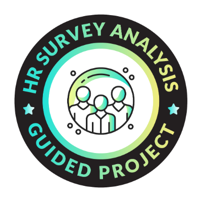
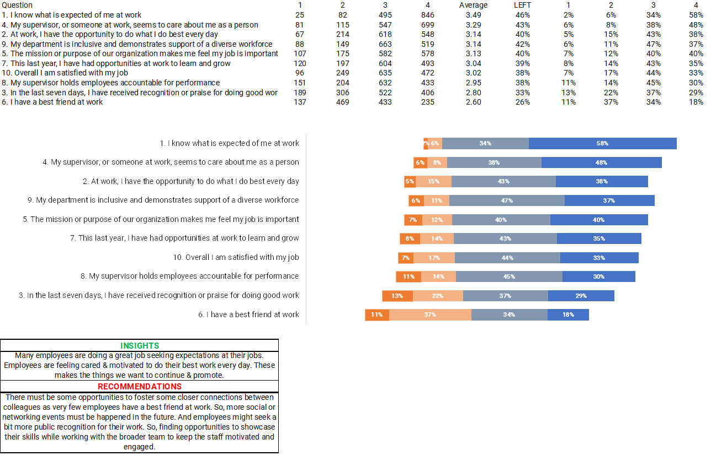
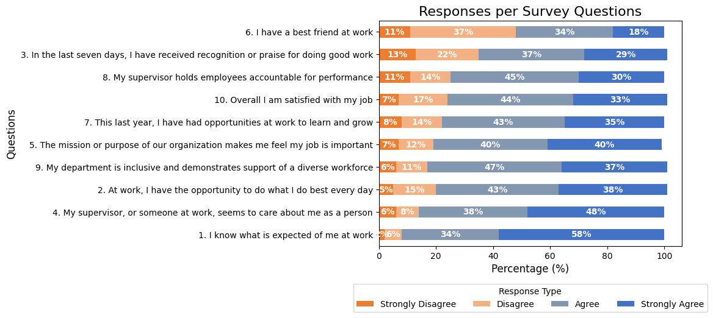

# HR Survey Response Analysis

## Project Overview

This project by [Maven Analytics](https://app.mavenanalytics.io/guided-projects/0dfc5e66-a0fc-4eaa-86f4-feddd033c0fb), analyzes employee survey responses using Pandas for data manipulation and MS Excel for additional analysis. The goal is to gain insights into employee satisfaction and areas for improvement within the organization. By examining the survey data, we can understand employee sentiments, recognize areas of strength, and identify opportunities for enhancing workplace culture.

## Data Files

The project consists of the following files:

- **Employee Survey Responses.zip**: A compressed file containing raw survey data and additional resources.
- **HR Employee Survey Responses.xlsx**: An Excel file with survey responses, including various metrics and analyses.
- **HREmpSurveyRes.xlsx**: An Excel file with analyses performed, featuring charts and visualizations that summarize key insights from the survey data.
- **hrSurveyAnal.ipynb**: Jupyter Notebook containing the analysis performed using Python's Pandas library.
  
## Graphs

The following visualizations were created to illustrate key findings from the survey data:

## Insights

- Many employees are doing a great job meeting expectations at their jobs.
- Employees feel cared for and motivated to do their best work every day.
- These positive sentiments are important to continue and promote within the organization.

## Recommendations

- There are opportunities to foster closer connections among colleagues, as very few employees report having a best friend at work. 
- Hosting more social or networking events in the future is essential.
- Employees may appreciate more public recognition for their efforts. 
- Finding ways to showcase their skills while collaborating with the broader team can help keep staff motivated and engaged.

## Conclusion

By analyzing the HR survey responses, this project provides valuable insights into employee satisfaction and areas for growth. The recommendations aim to enhance workplace culture and improve employee engagement within the organization.
