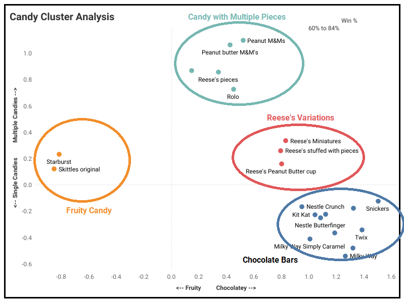

# Halloween Candy Popularity Predictor 🎃🍫

## About This Project
Ever wondered which Halloween candies will make you the most popular house on the block? This project dives into candy data to uncover the top three treats guaranteed to make trick-or-treaters flock to your door!

## Goal
To use data and analytics to find the three ultimate Halloween candies that will win you the hearts (and sweet teeth!) of your neighborhood.

## Approach
1. *Explore the Data*: Loaded and visualized candy data in Python.
2. *Uncover Patterns*: Applied PCA (Principal Component Analysis) to simplify and create a scatter plot for better insights.
3. *Find the Best Candies*: Used Tableau to identify clusters and filter down to the three best Halloween candy picks.

## My Top Picks 🎉
- Reese's Peanut Butter Cup: The all-around crowd favorite.
- Twix: A rich and satisfying chocolatey option.
- Starburst: For fruity candy lovers everywhere.

## Tableau Dashboard
Explore the candy cluster analysis and discover the top Halloween picks on my [Tableau Dashboard](https://public.tableau.com/app/profile/abhisekh.nayak/viz/CandyClusterAnalysis/CandyCluster).

## Sources
The dataset is provided by **Maven Analytics** as part of the [Maven Halloween Challenge](https://mavenanalytics.io/challenges/maven-halloween-challenge/701f06a2-a19b-41e9-95d3-37a0dcc5492f).

© The project is being made & submitted to **Maven Analytics** by [Abhisekh P. Nayak](https://abhiresumeweb.web.app).