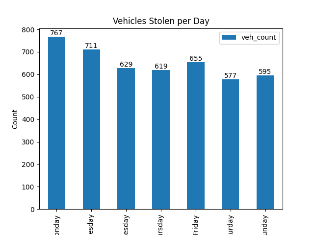
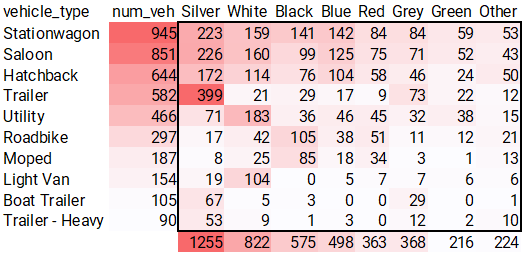
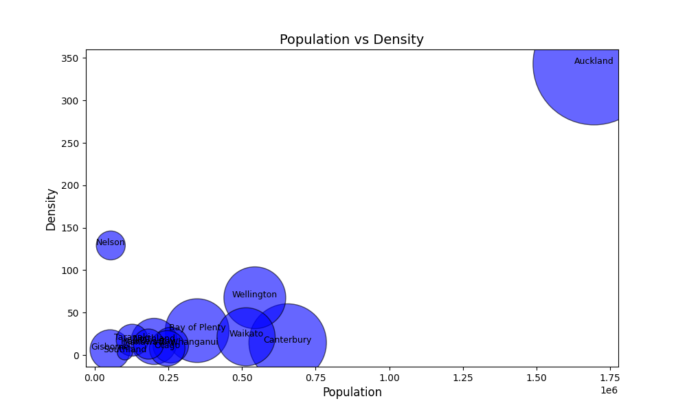
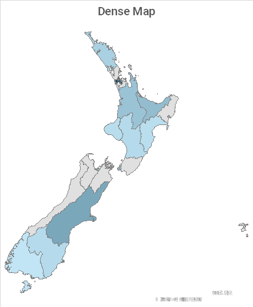

# Maven-NZPD Motor Vehicle Theft Analysis

## Project Overview
This project, provided by [Maven Analysis](https://app.mavenanalytics.io/guided-projects/e5bca282-033d-4d4e-940c-b8e993e54b9f) analyzes New Zealand vehicle theft data using Python's data analysis libraries (Pandas, Matplotlib, Seaborn), SQL for data manipulation, and MS Excel for additional visualization. The goal is to gain insights into vehicle theft patterns to support the New Zealand Police Department's public awareness campaign. By examining the theft database, we can understand temporal patterns, identify high-risk vehicles, and recognize geographical hotspots for targeted prevention strategies.

## Data Files
The project consists of the following files:
* **create_stolen_vehicles_db.sql**: SQL file for creating and structuring the vehicle theft database
* **category_a.sql to category_c.sql**: SQL files for data analysis using SQL
* **MavenVehThefts.xlsx**: Excel file containing comprehensive data visualizations and analysis
* **mvta_analysis.ipynb**: Jupyter Notebook with Python-based analysis using Pandas, Matplotlib, and Seaborn
* **images/**: Folder containing exported visualizations from both Excel and Python analysis
* **stolen_vehicles_db_data_dictionary.csv**: Data dictionary providing detailed information about database fields
* **obj1_results.csv to obj3_results.csv**: CSV files containing results from SQL analysis for different objectives

## Insights
* Temporal patterns show increased theft activity during summer months (October - March), with Monday and Friday being the most common days for incidents
* Vehicle analysis reveals Stationwagons, Saloons, and Hatchbacks as the most frequently targeted types, with silver-colored vehicles experiencing the highest theft rates
* Geographic distribution correlates strongly with population density, with Auckland reporting the highest number of cases and Southland showing the lowest incident rate

## Graphs

The following visualizations were created to illustrate key findings from the survey data:

## Recommendations
* Implement enhanced security measures during high-risk summer months
* Focus public awareness campaigns on owners of frequently targeted vehicle types
* Develop region-specific prevention strategies, particularly in high-density urban areas
* Encourage vehicle owners to consider security features, especially for high-risk vehicle categories
* Increase surveillance and patrols in identified hotspots during peak theft times

## Conclusion
By analyzing the vehicle theft data, this project provides valuable insights for both law enforcement and the public. The recommendations aim to improve vehicle security awareness and help citizens protect their property through informed decision-making and preventive measures.
