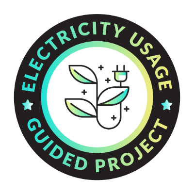

# Maven Analytics Project Workspace

The repository contains all the guided projects I completed with [Maven Analytics](https://www.mavenanalytics.io/) in SQL, Excel, Tableau Prep and Python, showcasing practical data analysis skills across various real-world datasets. Each project includes a Jupyter Notebook with a full analysis, detailed insights, and relevant visualizations. Additionally, each project folder contains a completion badge, highlighting my accomplishments in each area.

## Technologies Used
- **Programming Languages**: SQL, Python
- **Libraries**: pandas, NumPy, Matplotlib, Seaborn
- **Tools**: Jupyter Notebook, Excel, Tableau Prep

## Description
1. **Baby Names Analysis (MySQL, Python)**: View trends in baby name popularity based on US social security data from 1980-2010.
1. **Bank Customer Data Prep & EDA (Python)**: Clean and explore bank customer data to prepare it for machine learning models.
1. **Customer Complaint Tracking (Excel, Python)**: Create a report to track open and closed customer complaints for Bank of America.
1. **Electricity Usage Analysis (Python)**: Visualize seasonality in electricity consumption in Morocco.
1. **Predicting Fuel Economy (Python)**: Build a linear regression model to predict a vehicle's fuel efficiency.
1. **Global Electronics Retailer (Excel)**: Build a data model and interactive revenue report for a global retail company.
1. **HR Survey Analysis (Excel, Python)**: Visualize survey response data from ~1,500 city employees in Washington state.
1. **Manufacturing Downtime Analysis (Excel)**: Identify productivity improvement opportunities in a production line.
1. **Motor Vehicle Theft Analysis (Excel, MySQL & Python)**: Analyze vehicle thefts in New Zealand to identify when and where they take place.
1. **Traffic Safety Analysis (Excel & Python)**: Analyze traffic collisions in NYC to identify seasonal patterns and top contributing factors.
1. **Global Video Game Sales Analysis (Python)**: Build an interactive dashboard to explore & identify key insights in the global video games industry.
1. **World Economic Report (Python)**: Create a one-page report that highlights key insights on the state of the global economy.
1. **CrossFit Games Analysis (Tableau Prep)**: Analyze CrossFit Games' results and athlete profiles.

**NOTE**: 
- The repository also contains the folder for Maven Halloween Challenge using Tableau & Python. Check it out in the [README](MavenHCA/README.md) document.

## **Badges**

|  |  |  |  |
| --- | --- | --- | --- |
|  |  |  |  |
|  |  |  |  |
|  |  |  |  |
